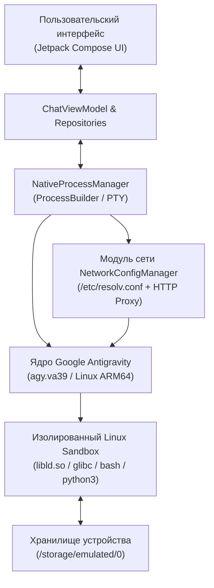

<div align="center">


# Google Antigravity Mobile (Android)

**Native Android Client & Embedded Linux Runtime for Google Antigravity (`agy` CLI)**

[](#)
[](#)
[](#)
[](#)
[](#)

[Скачать APK (Releases)](#-установка-и-загрузка) • [Возможности](#-ключевые-возможности) • [Архитектура](#-архитектура-системы) • [Сетевые настройки](#-smart-dns--http-прокси) • [Сборка](#-сборка-проекта)

</div>

---

## ✦ О проекте

**Antigravity Mobile** — это высокопроизводительное нативное Android-приложение, объединяющее графический интерфейс чата с мощным автономным ядром **Google Antigravity CLI (`agy.va39`)** и изолированным окружением Linux.

В отличие от стандартных веб-клиентов или сторонних надстроек над Termux, приложение **полностью автономно**: оно несёт в себе распаковываемый образ изолированного Linux-окружения с поддержкой `glibc`, Python 3.14, ffmpeg, curl, git, bash и запускает агентное ядро непосредственно в песочнице Android.

---

## 🚀 Ключевые возможности

### 1. Встроенное Linux-окружение и нативное ядро
- **Никаких внешних зависимостей**: не требует установленного Termux на телефоне, ядро и системные утилиты вшиты прямо в APK.
- **Поддержка Glibc и Dynamic Linker**: кастомный загрузчик `libld.so` и нативные системные библиотеки для прямого исполнения `agy.va39` на архитектуре `aarch64`.
- **Встроенный инструментарий разработчика**: `bash`, `python 3.14`, `ffmpeg`, `curl`, `git`, `busybox`.
- **Прямой терминал**: выполнение shell-команд прямо из строки ввода чата через префиксы `!команда` или `$команда`.

### 2. Стриминг и прозрачность агентов в реальном времени
- **Реалтайм-вывод мыслей и ответов**: отображение рассуждений модели, длительности размышлений и пословный стриминг ответов.
- **Отображение вызовов инструментов**: прозрачный показ выполняемых CLI команд (`▸ $ ffmpeg -i ...`, `▸ $ python3 script.py`), их стандартного вывода (stdout) и ошибок (stderr).
- **Автоматическая нормализация команд**: встроенные мобильные системные правила (`GEMINI.md`) предотвращают сбои (например, автоматический ключ `-vn` при обработке аудио в `ffmpeg`).

### 3. Smart DNS и HTTP Прокси (`DNS&PROXY`)
Встроенный модуль обхода региональных ограничений для работы с зарубежными ИИ-сервисами (ChatGPT, Claude, Gemini) без замедления всего трафика телефона:
- **`DNS-AI.RU`** (`192.144.59.14`, `186.246.49.127`) — интеллектуальный DNS для снятия гео-блокировок с ИИ-сервисов.
- **`XBOX-DNS`** (`111.88.96.54`, `111.88.96.55`) — Smart DNS прокси для игровых и облачных сервисов.
- **`SYSTEM / VPN (AUTO)`** — динамический перехват активных DNS серверов через `ConnectivityManager` (поддержка VPN на `tun0`).
- **Публичные DNS**: Cloudflare (`1.1.1.1`), Google (`8.8.8.8`) и **`CUSTOM DNS`** с ручным вводом любого IP.
- **HTTP Прокси-шлюз**: отключаемый шлюз (`http://host:port`) с быстрыми пресетами портов (`:10808` v2ray/xray, `:7890` clash, `:8080`), автоматически внедряемый во все сокеты и команды CLI (`http_proxy`, `https_proxy`, `ALL_PROXY`).

### 4. Авторизация и аккаунты Google
- **Встроенный браузер входа**: полноэкранный `WebView` диалог для мгновенного прохождения Google OAuth PKCE без выхода из приложения.
- **Прямой ввод токенов**: поддержка вставки кода авторизации (`4/0A...`) или готового JSON токена доступа.
- **Менеджер профилей**: сохранение нескольких аккаунтов, быстрое переключение и удаление.
- **Автоимпорт**: считывание токена из `/sdcard/Download/antigravity-oauth-token`.

### 5. Живой мониторинг квот и контекста (ASCII Quota)
- Точная визуализация лимитов API в терминальном стиле:
  - **Gemini Models** (Weekly Limit & 5-Hour Limit Remaining с таймером сброса).
  - **Claude & GPT Models** (индивидуальные шкалы потребления).
  - **Context Window Occupancy**: заполнение активного контекстного окна модели в токенах (`1 000 000` для Gemini, `200 000` для Claude).
- Ручная синхронизация лимитов с сервером Google одной кнопкой `[SYNC QUOTA]`.

### 6. Системные привилегии и память
- **Доступ ко всем файлам**: прямое чтение и запись в `/storage/emulated/0` (включая папку `Download`).
- **Root Shell (`su`)**: выполнение привилегированных команд без ограничений песочницы Android.
- **ADB через Shizuku**: выполнение команд системного шелла без наличия root-прав.
- **Режим `--dangerously-skip-permissions`**: автоматическое подтверждение действий агента без ручных запросов.

### 7. Кибернетический терминальный дизайн
- Строгий консольный стиль: глубокий чёрный фон (`#000000`), моноширинная типографика, квадратные рамки.
- Полное отсутствие неуместных эмодзи — все статусы оформлены в стиле Unix (`[READY]`, `[GRANTED]`, `[ACTIVE]`).
- Насыщенный сине-фиолетовый акцентный цвет (`#4863FF`) в сочетании с терминальным зелёным (`#00E676`) и янтарным (`#D29922`).

---

## 🏗 Архитектура системы



---

## 🛠 Настройки сети: Smart DNS и Прокси

Приложение позволяет тонко настраивать сетевые шлюзы в разделе **Settings -> DNS & PROXY**:

| Режим | IP-адреса | Назначение |
|---|---|---|
| **SYSTEM / VPN** | Динамически из Android | Автоматический подхват локального Wi-Fi или активного VPN соединения (`tun0`) |
| **DNS-AI.RU** | `192.144.59.14`<br>`186.246.49.127` | Обход региональных блокировок ИИ-сервисов (ChatGPT, Claude, Gemini) без проксирования всего интернета |
| **XBOX-DNS** | `111.88.96.54`<br>`111.88.96.55` | Специализированный Smart DNS для игровых и гео-ограниченных ресурсов |
| **CLOUDFLARE** | `1.1.1.1`, `1.0.0.1` | Быстрый общедоступный DNS с защитой приватности |
| **GOOGLE DNS** | `8.8.8.8`, `8.8.4.4` | Стандартный публичный резолвер Google |
| **CUSTOM** | Пользовательский IP | Ручной ввод любого DNS-сервера внутри вашей локальной сети или VPN |

---

## 📲 Установка и загрузка

Готовые APK файлы собираются автоматически через GitHub Actions при каждом релизе.

1. Перейдите на страницу **[GitHub Releases](https://github.com/Xlufoi/antigravity-cli-android/releases)**.
2. Скачайте последний файл **`Antigravity-v1.0.0.apk`**.
3. Установите APK на устройство с Android 8.0 или выше (архитектура **ARM64-v8a**).
4. При первом запуске откроется **Initial Setup Wizard**:
   - Дождитесь завершения автоматической распаковки ядра (`[1] APPLICATION UNPACKING`).
   - Авторизуйтесь в Google аккаунте (`[2] GOOGLE ACCOUNT LOGIN`).
   - Выдайте доступ к хранилищу файлов (`[3] DEVICE STORAGE ACCESS`).
   - Нажмите **`[DONE]`** (или **`[SKIP]`**) для перехода в консоль чата.

---

## 💻 Сборка из исходного кода

Для сборки проекта на компьютере требуется:
* **JDK 17** (Temurin или OpenJDK)
* **Android SDK** (API 34, Build Tools 34.0.0)
* **Gradle 8.7+**

```bash
# Клонирование репозитория
git clone https://github.com/Xlufoi/antigravity-cli-android.git
cd antigravity-cli-android

# Сборка debug APK
./gradlew assembleDebug

# Готовый файл будет находиться в:
# app/build/outputs/apk/debug/app-debug.apk
```

---

<div align="center">
Разработано для мобильной работы с передовыми агентами ИИ Google DeepMind Antigravity.
</div>
